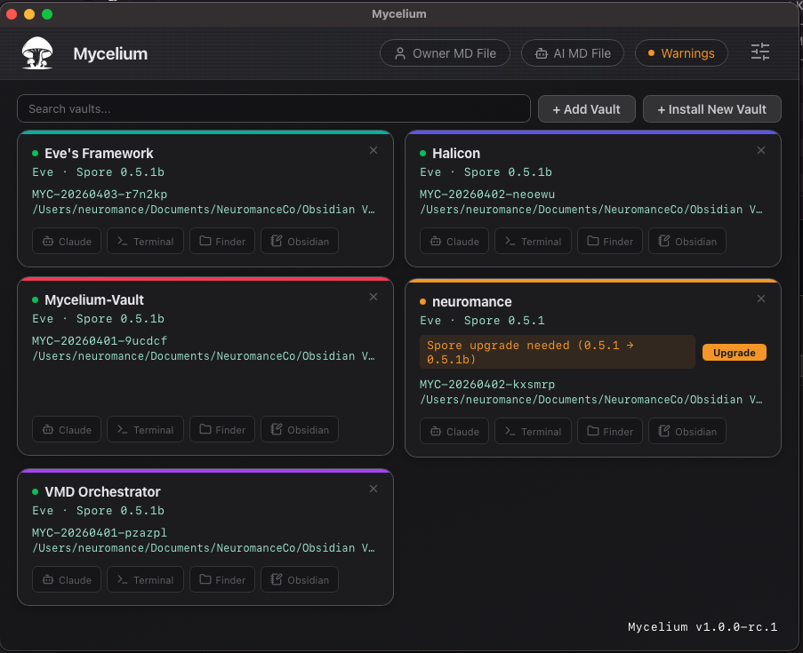

# Mycelium Desktop

**Keep your AI's context across every conversation.** Mycelium Desktop is the native macOS companion for Mycelium vaults — register, manage, launch, and upgrade your AI-memory vaults from a single window.



Built with Tauri, React, and Rust.

> **Release candidate — 1.0.0-rc.1.** This is the first public build. See [RELEASE_NOTES.md](RELEASE_NOTES.md) for what's in it and how to report issues.

---

## Why does this exist?

Every conversation with an AI starts from zero. You spend the first five minutes of every session re-explaining context that should already be there — who you are, what you're building, what you decided last week, what not to suggest again. Or you skip the re-briefing and get generic output. Either way, the memory problem taxes every interaction.

The fix isn't a better model. It's giving the model a memory it doesn't own. **Mycelium** is a framework for exactly that: a convention for local-first, portable AI memory stored as plain markdown on your disk — legible to humans, editable by hand, versionable in git, and carried across tools. Claude reads your vault at the start of every session and arrives knowing you. When the next model arrives, your memory comes with you.

**Mycelium Desktop** is the tool that makes running vaults effortless — vault registry, health checks, one-click Claude sessions, install and upgrade flows, persona management. One native window, all your vaults, no terminal gymnastics required.

---

## What is the Mycelium framework?

A **Mycelium vault** is a folder of structured markdown that describes a person, their work, their relationships, and their intent. At its core is **Spore** — a lean runtime specification that tells any AI assistant how to boot into the vault: what to read, in what order, under what rules, with what version discipline. Claude reads the vault at the start of every session and arrives knowing who you are and what you're working on — no re-onboarding, no lost context, no vendor lock-in.

**Mycelium Desktop** (this repo) is the companion app for managing those vaults. It doesn't run the AI — it runs the *operations* around the AI: vault registration, health checks, terminal launching, install and upgrade flows, persona file management. The Spore runtime itself ships bundled inside the app (see `src-tauri/resources/`) and will live in its own repo as it stabilises.

Mycelium is built and maintained by [neuromance](https://www.neuromance.co.za).

---

## Download

**→ [Download the latest release](https://github.com/neuromance-admin/Mycelium/releases/latest)**

### Requirements

- macOS 12 Monterey or later
- Apple Silicon (M1 / M2 / M3 / M4) — no Intel build in this release candidate
- [Claude Code CLI](https://docs.claude.com/en/docs/claude-code/overview) installed and on your `PATH` (required for the Claude / Install / Upgrade actions)
- [Obsidian](https://obsidian.md) (optional, used by the in-app Obsidian shortcut)

### Installing an unsigned build

Mycelium Desktop is not yet code-signed by Apple. When you first open the DMG, macOS will warn you that the app "can't be opened" or "is damaged." **This is expected** — it's Gatekeeper being strict about any app from a developer who hasn't paid the Apple Developer fee. A signed build will follow once the product graduates from release candidate.

**To unlock on first launch:**

1. Open the DMG and drag **Mycelium.app** into your **Applications** folder
2. Go to `/Applications` in Finder
3. **Right-click** (or Control-click) Mycelium.app → **Open** → click **Open** in the dialog
4. From here on, double-click launches normally

If step 3 doesn't show an **Open** button, go to **System Settings → Privacy & Security**, scroll to the bottom, find "Mycelium was blocked…" and click **Open Anyway**.

---

## What it does

- **Vault registry** — see every registered Mycelium vault with health status, runtime version, and owner info
- **One-click actions** — open any vault in Claude, Terminal, Finder, or Obsidian
- **Claude sessions** — the Claude button launches your chosen terminal with the vault's runtime loaded, so a full Mycelium session spins up in one click
- **Install new vaults** — pick a folder, Mycelium Desktop drops in the bundled installer and launches Claude to run it
- **Upgrade vaults** — bumps a vault's runtime to the latest Spore version with one click
- **Dynamic terminal detection** — Terminal.app, iTerm2, Warp, Ghostty, Kitty, and Alacritty are detected automatically; pick your preferred one in Settings
- **Light and dark themes** with a working in-app toggle
- **Persona shortcuts** — Owner and AI persona files one click away from the top bar (for setups using external persona directories)

---

## Building from source

Contributors and the curious can build Mycelium Desktop locally.

### Prerequisites

```bash
# Xcode Command Line Tools
xcode-select --install

# Rust
curl --proto '=https' --tlsv1.2 -sSf https://sh.rustup.rs | sh
source $HOME/.cargo/env

# Node.js and pnpm
brew install node
npm install -g pnpm
```

### Clone and run in dev mode

```bash
git clone https://github.com/neuromance-admin/Mycelium.git
cd Mycelium
pnpm install
pnpm tauri dev
```

Dev mode gives you hot reload on the React frontend and auto-recompile on Rust backend changes.

### Build a release DMG

```bash
pnpm tauri build
```

Built artifacts land in `src-tauri/target/release/bundle/`:

- `macos/Mycelium.app` — the bundled application
- `dmg/Mycelium_<version>_aarch64.dmg` — the installer

---

## Project structure

```
Mycelium/
├── src/                        # React frontend
│   ├── App.tsx                 # Main app, vault registry, settings, handlers
│   ├── App.css                 # Design system + component styles
│   └── assets/                 # SVG icons and logos
├── src-tauri/
│   ├── src/
│   │   └── lib.rs              # Rust backend: vault parsing, terminal detection, install/upgrade
│   ├── resources/              # Bundled Spore runtime files (installer + upgrade)
│   ├── icons/                  # macOS, iOS, Android icon sets
│   └── tauri.conf.json         # Tauri bundler config
├── README.md
└── RELEASE_NOTES.md
```

The `resources/` directory ships the current Spore runtime files inside the app bundle — so a fresh install of Mycelium Desktop always has the installer and upgrade procedures it needs, without an external download.

---

## What's coming

Mycelium Desktop is actively developed. Here's what's on the roadmap:

### Native vault tools

The Spore runtime ships with a full toolset that currently runs through the AI in conversation — vault audits, health checks, network layer management, migration, and standards enforcement. We're bringing all of them into the Desktop app as native operations.

- **Audit** — full vault diagnostic from the UI: coverage, integrity, broken links, orphans, persona health, overview staleness. Review and resolve findings without a Claude session.
- **Health Check** — lightweight index integrity, frontmatter sampling, persona resolution, orphan detection, and root cleanliness. One click, instant report.
- **Network Layer** — peer registration, collaborator management, guest IDs, and propagation rules managed visually instead of through conversation.
- **Migration** — version upgrades triggered and tracked from the app, with rollback visibility and health check on completion.
- **Standards** — ID validation, node schema enforcement, and category conventions surfaced as warnings and quick-fixes in the vault view.

The goal: everything the AI can do operationally, the app can do natively — faster, without spending tokens, and without needing a session open.

### Vault backups

One-click backup for any individual vault or all registered vaults at once. Your memory is your most valuable asset — it should be trivial to snapshot and safeguard it.

---

## Feedback

This is a release candidate precisely because the best bugs are found by other people. If you try Mycelium Desktop and something breaks, surprises you, or just feels off, drop me a line at **halicon@gmail.com**, or open an issue on GitHub. I'd rather hear it early than ship 1.0 with it still in there.

---

## License

Apache License 2.0. See [LICENSE](LICENSE).

---

## Credits

- **Framework** — [Tauri](https://tauri.app/) · [React](https://react.dev/)
- **Icons** — [Lucide](https://lucide.dev/)
- **AI** — [Anthropic / Claude](https://www.anthropic.com/)
- **Designed and built** by halicon at [neuromance](https://www.neuromance.co.za)

---

*Part of the Mycelium Network Framework. Built to compound over time.*
